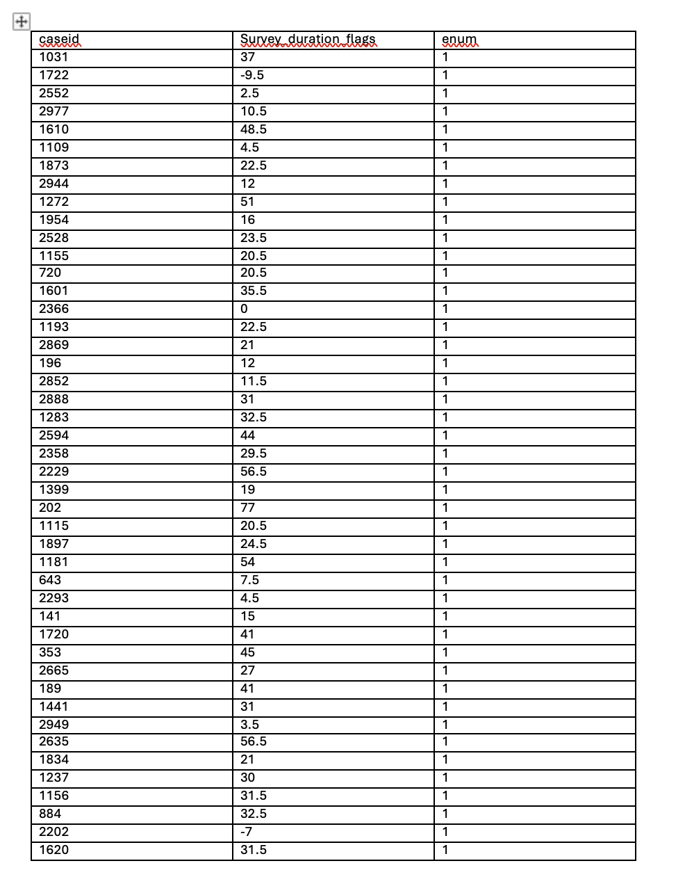
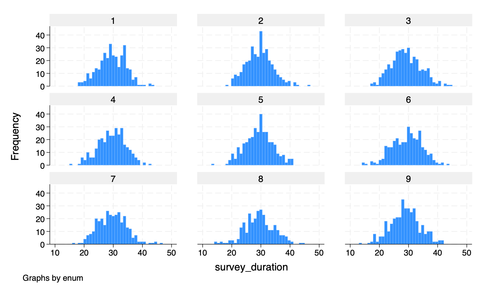
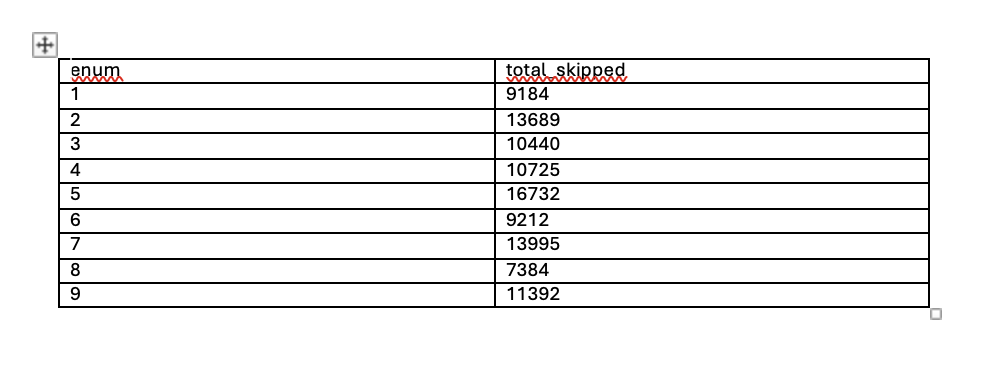
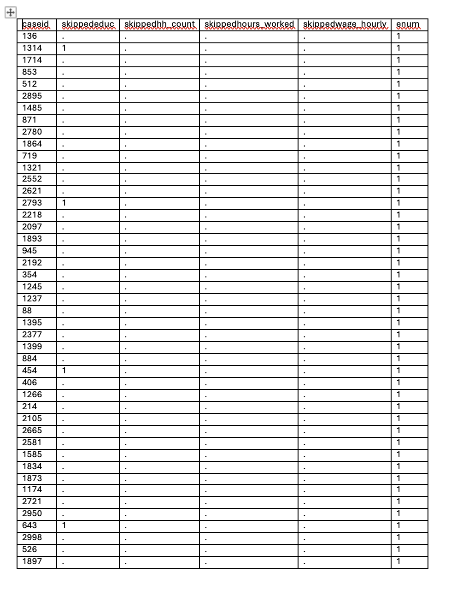
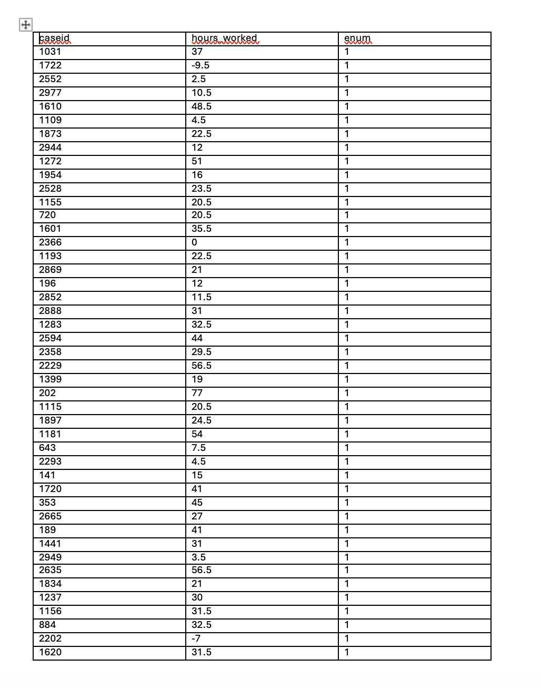

## HFCs - STATA 5 
We created three checks that cover: survey duration flags, flags for missing vlaues (of specific/important variables) per enumerator and flags for outliters/mis-entries.
We created a dataset in STATA that mimics (to some extent) data collection on weekly hours worked, educaiton level, household count, hourly wage. In addition, we created variables that capture unique caseid of respondents, enumerator ID, and a survey duration var that would caputre the time between start and end time of the survey carried out by an enumerator in SurveyCTO. The dataset was based on average hourly wage in Malawi and created some vars to have mis-entries, such as negative numbers for weekly hours. 
These checks would be carried out post data collection and flag enumerator and caseid info so that the officer in charge of the enumerators would be able to give both general feedback to enumerators (on e.g., average survey times/ missing values) as well as identify specific/key data that needs to be re-addressed, potentially by carrying out another survey. 
### Dataset code: 
***************************************
*** CREATE DATASET ********************
***************************************
- set seed 68
- set obs 3000
- gen caseid = _n 
- gen educ = floor(runiform(0,18))
- replace educ=. if runiform() <.1 
- gen hh_count = floor(runiform(0,20))
- replace hh_count=. if runiform() <.01 
- gen hours_worked = round(rnormal(25,20),.5)
- replace hours_worked=. if runiform() <.001 
- gen wage_hourly = round(runiform(0,2),.5)
- replace wage_hourly=. if runiform() <.01 
- gen survey_duration = floor(rnormal(30,5))
- gen enum = floor(runiform(1,10))
- gen duration_high = 0 
- gen duration_low = 0 
- replace duration_high = 1 if survey_duration < 5 
- replace duration_low = 1 if survey_duration > 50
***************************************
### Check 1: Survey Duration 
We created a check for survey duration by enumerator that flags surveys that are suspiciously/worryingly low in duration or high in duration. We might worry about low duration surveys in cases where enumerators are skipping questions to be done with surveys sooner and not spending the adequate time to collect data. This might occur because they are skipping certain questions that are time consuming to ask, or require additional explanation to ensure the respondent understands the question. This might also occur becuase they are skipping certain sections of the survey which are also harder/longer to ask about. Therefore, having a check on overall survey duration, as well as breakdown of length of time per section of the survey is one way to ensure and compare that surveys are taking equal lengths across enumerators. This will help ensure higher quality of data and an opportunity to check with specific enumerators who are flagged that they are carrying out the survey as intended. It is also a way to ensure that the survey is a reasonable length for both the enumerator and respondent, to ensure that questions and responses given are more accurate (becuase if it is e.g., too long then respondents may get tired and deliver less reliable info). 
***************************************
*** CHECK 1: survey duration checks ***
***************************************  
- bysort enum: sum survey_duration 
- histogram survey_duration, by(enum) freq
- sum survey_duration 
- list caseid survey_duration enum if duration_high ==1 
- list caseid survey_duration enum if duration_low ==1  
- tabstat survey_duration, by (enum) stat(mean median sd min max) 
- preserve
- gsort enum
- putdocx begin
- putdocx table list_replacement = data(caseid survey_duration enum), varnames
- putdocx save demodoc.docx, replace
- restore

***************************************
### Check 2: Missing Values 
This check was designed to flag enumerators who have a high number of missing values. This may be especially important if there is an important variable that is part of the study (e.g., income) but for some reason is hard to measure (potentially because it takes respondents lots of time to think / calculate their income, or if for some reason it requires extra effort by the enumerator to explain the question and collect accurate data, enumerators may be inclined to skip the question to save time and effort. This would be concerning if it was a primary outcome variable that is important to the study design / analysis. Therefore, we might want to capture by enumerator how many missing values we have of e..g, a particularly important variable or how many missing values in total by enumerator (since this might be a concern if an enumerator is inclined to just skip a question when they don't feel like collecting the data). It could also be helpful to highlight particular questions that are getting skipped / giving back missing values for lots of enumerators, because maybe then the question needs to be reframed/redesigned to make it easier for enumerators to ask the question. And the other resaon we might want to measure missing values by enumerator at a higher level is to ensure they are not skipping questions to reduce their required effort. Moreover, it may highlight that enumerators are having trouble extracting the info from respondents if many enumerators have missing values for the same question, in which case, the field manager could organize a meeting to uncover what the issue is and then potentially reword the question or remove it and replace it with something more appropriate.
***************************************
*** CHECK 2: missing values ***********
***************************************

//total number of skips per enumerator - flag enumerators who are missing high number of values per survey 

- foreach var of varlist educ hh_count hours_worked wage_hourly {	
- gen skipped`var' = 1 if `var' == . 		
}

- bysort enum: egen total_skipped = total(missing(educ))
- preserve
- collapse (sum) total_skipped, by(enum)
- putdocx begin
- putdocx table summary = data(enum total_skipped), varnames border(all, single)
- putdocx save enumerator_skip_summary.docx, replace
- restore

//list all missings for each variable by enumerator - more detailed info on surveys that may need to be redone (info on caseid, enum, missing values)
foreach var of varlist educ hh_count hours_worked wage_hourly {
	di "all cases where `var' is skipped"
	bysort enum: list caseid enum `var' if skipped`var' == 1
	bysort enum: count if skipped`var'==1	
}

//if in the survey we know there is one esp important var that is often missed because for whatever reason there is resilience to answering questions about it (maybe more effort/not easy to answer in straightforward way, we may want a single identifier for when it is skipped)

- di "all cases where hours_worked is skipped"
- bysort enum: list caseid enum hours_worked if skippedhours_worked == 1  
- bysort enum: count if skippedhours_worked == 1
- preserve
- gsort enum
- putdocx begin
- putdocx table list_replacement = data(caseid skippededuc skippedhh_count skippedhours_worked skippedwage_hourly enum), varnames
- putdocx save missing_var_enum.docx, replace
- restore

***************************************
Check 3: Outliers / mis-entries 
This check checks for potential mis-entries by human error by enumerator or respondents misinterpreting the question (and the enumerator not catching onto this) and therefore, recording information that does not match what the question is asking for. This is an especially important check if the survey does not have sufficient restrictions in place. One example would be data collection on weekly hours worked , e.g., potentially through multiple sources of work, and then the total sum of weekly hours being greater than 168 hours per week which is not possible (or on the end of the scale, a negative number being recorded). This flag is intended to catch variables that have clearly been mis-recorded either because they have been accidentially mis-entered by the enumerator or because the respondent has mis-understood the question and given an answer that does not make sense for the question. This would flag the response, the caseid and the enumerator. This would give the field manager officer the opportunity to identify the enumerator and particular survey / survey question that may need to be redone in order to collect accurate data.
***************************************
*** CHECK 3: outliers for variables ***
***************************************
- gen flag_hours = 0 
- replace flag_hours = 1 if hours_worked > 70 & hours_worked !=.
- replace flag_hours = 1 if hours_worked < 0 
- bysort enum: list caseid hours_worked if flag_hours ==1 
- preserve
- keep if flag_hours == 1
- keep caseid hours_worked enum
- gsort enum
- export delimited  "outliers.csv"
- restore

